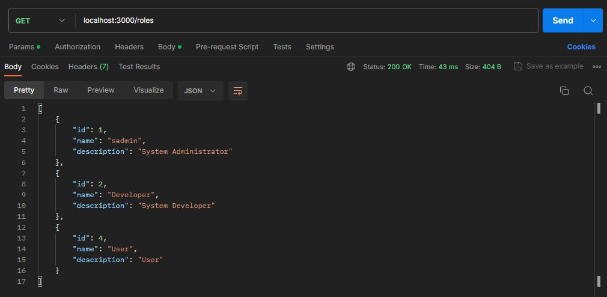
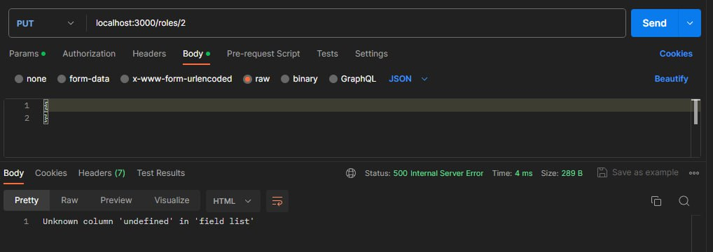

# Тестування працездатності системи

## Інформація про тестування
Тестування відбувається за допомогою програми ***Postman***. Його використання дає змогу виконувати запити з різними методами, параметрами тощо.

## Отримання всіх ролей

## Отримання однієї ролі

Тут можна побачити спробу отримати інформацію про роль з id = 3, проте такої ролі не існує у нашії бд, тому сервер повертає нам код ***204*** "No Content".

## Оновлення інформації про роль

Тіло нашого запиту не містить потрібної нам інформації, тому сервер повертає нам код ***500*** та інформує про помилку

Ми вказали інформацію, яку ми хочемо оновити, тож ми отримали відповідь про те, чи відбулася зміна

Перевіряємо чи дійсно інформація була змінена, і отримуємо позитивний результат

*Просто демонстрація можливості змінити опис ролі*

## Створення ролі

Відправляємо запит з обов'язковою інформацією, та отримуємо новостворену роль, разом з її ID

Поле ***description*** - не є обов'язковим, проте ***name*** - обов'язкове поле, без якого роль не може існувати. Тобто якщо ми спробуємо зробити роль без назви - ми отримаємо код ***400*** та повідомлення про те, що потрібно вказати назву

Задля перевірки, робимо знову запит на отримання всіх ролей, та помічаємо нові ролі

## Видалення ролі

Попередньо видалили з бази даних користувачів, які мали цю роль та пересвідчилися, що роль не має жодних прав

Намагаємося видалити роль та отримуємо позитивний результат

Тепер спробуємо видалити роль, яка має певний перелік прав та користувачів, які нею володіють.

Як вже було раніше сказано, наші ролі пов'язані з таблицями: *права-ролі* та користувачів. Через це, коли ми спробуємо зробити запит на видалення ролі, яку має хоч один користувача, або ж ця роль має хоч один запис у таблиці *права-ролі* - ми отримуємо помилку з кодом ***500*** та інформацією помилки з mysql запиту.

З причини існування таких зв'язків, ми реалізували послідовне видалення інформації з різних таблиць, якщо користувач все-таки хоче зробити це примусово

Як ми бачимо, інформація була успішно видалена

## Видалення всіх ролей

Тут ми знову отримуємо помилку, бо видалення усіх ролей може спричинити багато проблем. Логічне питання, нащо тоді цей функціонал існує? Цей функціонал може бути потрібним при початковому створенні, налаштуванні та тестуванні бази даних